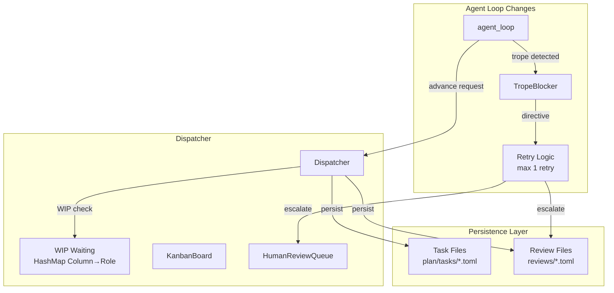
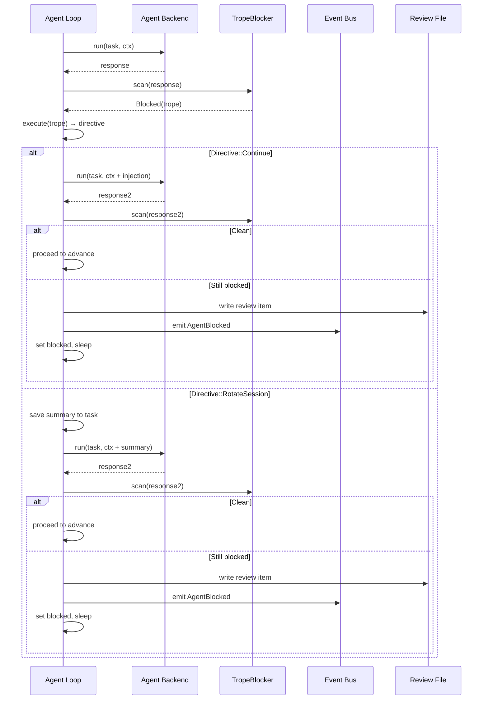
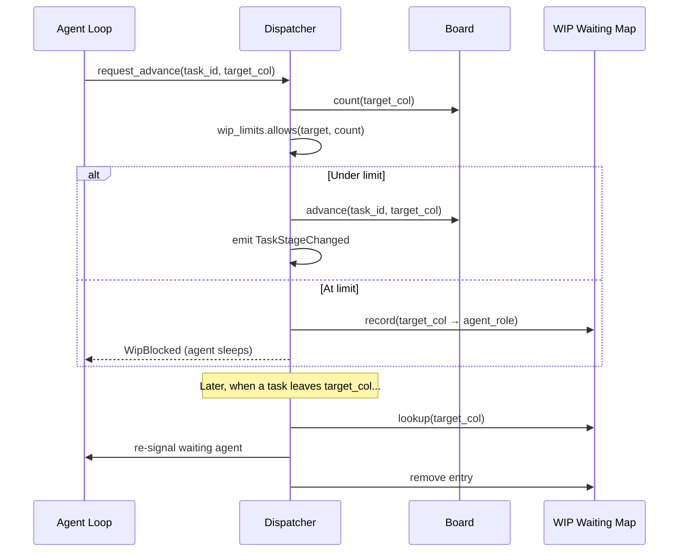

# Design Document: Dispatcher Audit Fixes

## Overview

This spec addresses 11 issues identified in the post-implementation audit of the event-driven dispatcher. The changes span: review item persistence, UUID v7 identifiers, TropeBlocker retry logic, event emission gaps, WIP limit enforcement, AgentBlocked flow, config validation, daemon HOME discovery, and minor API/serialization fixes.

The design prioritizes minimal structural change — most fixes are surgical additions to existing control flow rather than architectural rewrites. The largest new subsystem is the review item persistence layer (`state/review.rs`).

### Design Decisions

1. **Review items are their own persisted resource** — stored in `~/.gitzi/<session>/reviews/{id}.toml` with an `actions` array that grows on each human interaction. This avoids conflating review state with task state while still persisting alongside it.

2. **UUID v7 via the `uuid` crate's v7 feature** — the existing `uuid = "1"` dependency supports v7 via the `v7` feature flag. Base64url encoding uses the `base64` crate with `URL_SAFE_NO_PAD` config. No new crate needed for either concern beyond adding `base64`.

3. **TropeBlocker retry is in-line, not event-driven** — the retry happens synchronously within `handle_agent_result()` before any events are emitted. This keeps the retry logic local to the agent loop and avoids event bus complexity for an internal concern.

4. **WIP waiting state is a HashMap on the Dispatcher** — `HashMap<Column, AgentRole>` records which agent is waiting to advance into a full column. When a task leaves that column, the dispatcher re-signals the recorded agent. Not persisted — it's purely runtime state rebuilt on boot.

5. **AgentResult gains a `Blocked` variant** — the existing `AgentResult { success, output }` struct becomes an enum with `Success { output }`, `Failure { output }`, and `Blocked { question }` variants. This is the structured signal for agent questions.

6. **Double-signal fix: remove run-loop signal on HumanApprovalReceived** — `approve()` already signals the agent directly. The run loop handler for `HumanApprovalReceived` becomes a no-op (logging only). Same for `HumanRejectionReceived`.

## Architecture



### TropeBlocker Retry Flow



### WIP Limit Enforcement Flow



## Components and Interfaces

### New Modules

| Module | Responsibility |
|--------|---------------|
| `src/state/review.rs` | Review item TOML persistence (read/write/load_all) |
| `src/id.rs` | UUID v7 + base64url + slug ID generation |

### Modified Modules

| Module | Changes |
|--------|---------|
| `src/agent/backend.rs` | `AgentResult` becomes enum with `Blocked` variant |
| `src/dispatcher/agent_pool.rs` | TropeBlocker retry logic, AgentBlocked flow, WIP gate |
| `src/dispatcher/mod.rs` | WIP waiting map, persist on approve/reject, remove double-signal, emit TaskStageChanged |
| `src/dispatcher/event_bus.rs` | Add `Deserialize` derive to `DispatchEvent` |
| `src/dispatcher/review_queue.rs` | Add `Deserialize` to `HumanReviewItem` and `ReviewItemKind` |
| `src/config.rs` | Role validation on load, hardcoded defaults per role, new `resolve_agent` logic |
| `src/daemon/mod.rs` | Write `Environment=HOME=...` in systemd unit |
| `src/model/task.rs` | Remove `wip_limit_blocked` field, add `resume_summary` field |
| `src/state/home.rs` | Add `reviews_dir()` helper |
| `src/state/reader.rs` | Add `load_all_review_items()` |
| `Cargo.toml` | Add `base64` dep, enable `uuid/v7` feature |

### Key Type Changes

```rust
// src/agent/backend.rs — AgentResult becomes an enum

#[derive(Debug, Clone)]
pub enum AgentResult {
    Success { output: String },
    Failure { output: String },
    Blocked { question: String },
}
```

```rust
// src/id.rs — new module

use base64::engine::general_purpose::URL_SAFE_NO_PAD;
use base64::Engine;
use uuid::Uuid;

/// Word list for slug generation (embedded at compile time).
const WORDS: &[&str] = &[/* 256-entry word list */];

/// Generate a new resource ID: `{uuid7_base64url}-{three-word-slug}`
pub fn new_id(title: &str) -> String {
    let uuid = Uuid::now_v7();
    let b64 = URL_SAFE_NO_PAD.encode(uuid.as_bytes());
    let slug = derive_slug(title);
    format!("{b64}-{slug}")
}

/// Deterministic 3-word slug from title using a simple hash.
fn derive_slug(title: &str) -> String {
    // Use first 6 bytes of a hash of the title to index into WORDS
    // Each 2-byte pair selects a word: hash[0..2] → word1, hash[2..4] → word2, hash[4..6] → word3
    // Index = u16::from_le_bytes([hash[i], hash[i+1]]) % WORDS.len()
    todo!()
}
```

```rust
// src/state/review.rs — persisted review item

use chrono::{DateTime, Utc};
use serde::{Deserialize, Serialize};
use crate::dispatcher::Column;

#[derive(Debug, Clone, Serialize, Deserialize)]
#[serde(tag = "type", rename_all = "snake_case")]
pub enum ReviewAction {
    Approval { at: DateTime<Utc> },
    Rejection { at: DateTime<Utc>, feedback: String },
    Answer { at: DateTime<Utc>, content: String },
}

#[derive(Debug, Clone, Serialize, Deserialize)]
#[serde(tag = "type", rename_all = "snake_case")]
pub enum PersistedReviewKind {
    AgentQuestion { question: String },
    BufferApproval { buffer_column: Column, task_priority: u32 },
}

#[derive(Debug, Clone, Serialize, Deserialize)]
pub struct PersistedReviewItem {
    pub id: String,
    pub task_id: String,
    pub kind: PersistedReviewKind,
    pub created_at: DateTime<Utc>,
    #[serde(default)]
    pub actions: Vec<ReviewAction>,
}

impl PersistedReviewItem {
    /// True if no terminal action (approval/rejection/answer) has been recorded.
    pub fn is_unresolved(&self) -> bool {
        self.actions.is_empty()
    }
}

// ── Persistence functions ─────────────────────────────────────────────────────

pub fn reviews_dir() -> crate::error::Result<std::path::PathBuf> {
    Ok(crate::state::home::session_dir()?.join("reviews"))
}

pub fn write_review_item(item: &PersistedReviewItem) -> crate::error::Result<()> {
    let dir = reviews_dir()?;
    std::fs::create_dir_all(&dir)?;
    let path = dir.join(format!("{}.toml", item.id));
    crate::config::atomic_write(&path, &toml::to_string_pretty(item)?)
}

pub fn load_review_item(id: &str) -> crate::error::Result<PersistedReviewItem> {
    let path = reviews_dir()?.join(format!("{id}.toml"));
    let text = std::fs::read_to_string(&path)?;
    Ok(toml::from_str(&text)?)
}

pub fn load_all_unresolved() -> crate::error::Result<Vec<PersistedReviewItem>> {
    let dir = reviews_dir()?;
    if !dir.exists() { return Ok(Vec::new()); }
    let mut items = Vec::new();
    for entry in std::fs::read_dir(&dir)? {
        let path = entry?.path();
        if path.extension().and_then(|e| e.to_str()) == Some("toml") {
            let text = std::fs::read_to_string(&path)?;
            let item: PersistedReviewItem = toml::from_str(&text)?;
            if item.is_unresolved() {
                items.push(item);
            }
        }
    }
    Ok(items)
}
```

```rust
// src/config.rs — hardcoded defaults and validation

impl AgentRole {
    /// Hardcoded default AgentDef for this role.
    pub fn default_agent_def(&self) -> AgentDef {
        AgentDef {
            role: self.to_string(),
            model: "claude-sonnet-4-6".to_string(),
            system_prompt: Some(self.default_system_prompt().to_string()),
        }
    }

    fn default_system_prompt(&self) -> &'static str {
        match self {
            AgentRole::Prioritizer => "You break epics into minimal, independently-shippable tasks ordered by dependency and value.",
            AgentRole::Designer => "You produce concise technical designs. No code — architecture, data models, interfaces only.",
            AgentRole::Coder => "You are a disciplined coding agent. Make the smallest possible change. No refactoring, no extras.",
            AgentRole::Reviewer => "You review code for correctness, security, and adherence to the design. Flag issues, never rewrite.",
            AgentRole::Tester => "You write and run tests. Property-based where applicable, example-based otherwise.",
            AgentRole::Auditor => "You perform security audits. Check for vulnerabilities, leaked secrets, unsafe patterns.",
            AgentRole::Infrarian => "You manage deployment infrastructure. Minimal, reproducible, observable.",
        }
    }
}

impl Config {
    /// Validate config on load. Returns error for unknown role names.
    pub fn validate(&self) -> Result<()> {
        for agent in &self.agents {
            if !AgentRole::all().iter().any(|r| r.to_string() == agent.role) {
                return Err(GitziError::Config(
                    format!("unknown agent role '{}' in config — valid roles: {:?}",
                        agent.role,
                        AgentRole::all().iter().map(|r| r.to_string()).collect::<Vec<_>>())
                ));
            }
        }
        Ok(())
    }

    /// Find agent by role: config first, then hardcoded default. Never first-in-list.
    pub fn resolve_agent(&self, role: &str) -> AgentDef {
        self.agents.iter().find(|a| a.role == role).cloned()
            .unwrap_or_else(|| {
                AgentRole::all().iter()
                    .find(|r| r.to_string() == role)
                    .map(|r| r.default_agent_def())
                    .unwrap_or_else(|| AgentRole::Coder.default_agent_def())
            })
    }
}
```

```rust
// src/dispatcher/mod.rs — WIP waiting map addition

pub struct Dispatcher {
    pub event_bus: Arc<EventBus>,
    pub board: Arc<RwLock<KanbanBoard>>,
    pub review_queue: Arc<Mutex<HumanReviewQueue>>,
    pub agent_pool: AgentPool,
    pub config: Arc<Config>,
    pub wip_limits: WipLimits,
    /// Agents waiting to advance into a full column.
    wip_waiting: Arc<Mutex<HashMap<Column, AgentRole>>>,
}
```

### Systemd Unit Template Change

```ini
[Unit]
Description=gitzi agent orchestrator daemon
After=network.target

[Service]
Type=simple
ExecStart={binary} --daemon
Environment=HOME={home}
Restart=on-failure
RestartSec=5

[Install]
WantedBy=default.target
```

The `{home}` value is read from `std::env::var("HOME")` at install time and written literally into the unit file.

### Agent Loop Control Flow (post-fix)

```rust
// Pseudocode for the revised handle_agent_result in agent_pool.rs

async fn handle_agent_result(handle, event_bus, board, task, result, config, ctx) {
    match result {
        AgentResult::Blocked { question } => {
            // Persist review item, emit AgentBlocked, set blocked, sleep
            let item = PersistedReviewItem::new(task.id, AgentQuestion { question });
            write_review_item(&item)?;
            event_bus.emit(AgentBlocked { task_id, agent_role, question });
            handle.set_blocked(true);
            // Add to in-memory queue
            review_queue.lock().enqueue(item.into());
            return; // agent loop will sleep on Notify
        }
        AgentResult::Failure { output } => {
            warn!("agent failure, leaving task in column");
            return;
        }
        AgentResult::Success { output } => {
            // TropeBlocker scan
            match trope_blocker::scan(&output) {
                ScanResult::Clean => {
                    // WIP check before advancing
                    try_advance(handle, event_bus, board, task, config).await;
                }
                ScanResult::Blocked(trope_match) => {
                    let directive = trope_blocker::execute(&trope_match, ...);
                    // ONE retry
                    let retry_ctx = match directive {
                        Directive::Continue { injection } => {
                            ctx.with_injection(injection)
                        }
                        Directive::RotateSession { summary } => {
                            // Save summary to task metadata
                            save_resume_summary(task, &summary).await;
                            ctx.with_resume_summary(summary)
                        }
                    };
                    let retry_result = backend.run(&task, &retry_ctx).await;
                    match retry_result {
                        Ok(AgentResult::Success { output }) if trope_blocker::scan(&output).is_clean() => {
                            try_advance(handle, event_bus, board, task, config).await;
                        }
                        _ => {
                            // Escalate: create review item, block
                            let item = PersistedReviewItem::new(task.id, AgentQuestion {
                                question: "Agent stuck after trope correction — needs human guidance".into()
                            });
                            write_review_item(&item)?;
                            event_bus.emit(AgentBlocked { ... });
                            handle.set_blocked(true);
                        }
                    }
                }
            }
        }
    }
}

async fn try_advance(handle, event_bus, board, task, wip_limits, wip_waiting) {
    let target = handle.role.column().next();
    let Some(target_col) = target else { return; }; // Deploying → Done has no limit

    let count = board.read().await.count(target_col);
    if !wip_limits.allows(target_col, count as u32) {
        // Record waiting agent, do NOT advance
        wip_waiting.lock().await.insert(target_col, handle.role);
        return; // agent sleeps
    }

    let from_col = handle.role.column();
    board.write().await.advance(&task.id, target_col)?;

    // Emit TaskStageChanged FIRST
    event_bus.emit(TaskStageChanged { task_id: task.id, from: from_col, to: target_col });
    // Then AgentCompleted
    event_bus.emit(AgentCompleted { task_id: task.id, agent_role: handle.role });
}
```

### Run Loop Changes (double-signal fix)

```rust
// In Dispatcher::run() match arms:

DispatchEvent::HumanApprovalReceived { task_id, target_column } => {
    // NO-OP: approve() already signalled the agent.
    // This event exists for TUI/logging consumers only.
    info!(%task_id, %target_column, "approval event received (no-op in run loop)");
}

DispatchEvent::HumanRejectionReceived { task_id, returned_to, feedback: _ } => {
    // NO-OP: reject() already signalled the agent.
    info!(%task_id, %returned_to, "rejection event received (no-op in run loop)");
}

DispatchEvent::TaskStageChanged { task_id, from: _, to } => {
    if to.is_buffer() {
        // Create BufferApproval review item (persisted + in-memory)
        let priority = board.read().await.task(&task_id).map(|t| t.priority).unwrap_or(u32::MAX);
        let item = PersistedReviewItem::new(&task_id, BufferApproval { buffer_column: to, task_priority: priority });
        write_review_item(&item)?;
        let queue_item = HumanReviewItem::from(&item);
        review_queue.lock().await.enqueue(queue_item);
    }
    // Check if a waiting agent can now advance (WIP slot freed)
    if let Some(role) = wip_waiting.lock().await.remove(&from) {
        agent_pool.signal(role);
    }
}
```

## Data Models

### Review Item TOML (new resource)

```toml
id = "AZD3kF8RdE2x_Qw-review-auth-check"
task_id = "AZD3kF8RdE2x_Qw-coding-auth-middleware"
created_at = "2026-06-15T10:30:00Z"

[kind]
type = "buffer_approval"
buffer_column = "coding-buffer"
task_priority = 50

[[actions]]
type = "approval"
at = "2026-06-15T11:00:00Z"
```

### Task TOML Changes

```diff
- wip_limit_blocked = false    # REMOVED
+ resume_summary = "..."       # ADDED (optional, for session rotation)
```

The `resume_summary` field stores the summary text from a `Directive::RotateSession` so the agent can resume with context after a session rotation.

### Cargo.toml Changes

```diff
 uuid = { version = "1", features = ["v4", "v7", "serde"] }
+base64 = "0.22"
```

### ID Format Examples

| Old format | New format |
|-----------|-----------|
| `a1b2c3d4` | `AZD3kF8RdE2x_Qw-coding-auth-middleware` |
| `e5f6a7b8` | `AZD4LmNpQ2Rx_AA-fix-login-timeout` |

The base64url prefix is always 22 characters (16 bytes of UUID → ceil(16*4/3) = 22 base64 chars without padding). The slug is 3 lowercase words from a fixed 256-word list, separated by hyphens.

### DispatchEvent with Deserialize

```rust
#[derive(Debug, Clone, Serialize, Deserialize)]
#[serde(tag = "type", rename_all = "snake_case")]
pub enum DispatchEvent {
    TaskCreated { task_id: String },
    TaskStageChanged { task_id: String, from: Column, to: Column },
    HumanApprovalReceived { task_id: String, target_column: Column },
    HumanRejectionReceived { task_id: String, returned_to: Column, feedback: String },
    AgentCompleted { task_id: String, agent_role: AgentRole },
    AgentBlocked { task_id: String, agent_role: AgentRole, question: String },
    BootComplete,
}
```

`AgentRole` also needs `Deserialize` added (currently only has `Serialize`).

### git2 0.21 commit.summary() Fix

```rust
// Current (broken with git2 0.21):
let message = commit.summary().unwrap_or(None).unwrap_or("(no message)");

// Fixed (git2 0.21 returns Option<&str>):
let message = commit.summary().unwrap_or("(no message)");
```

## Correctness Properties

*A property is a characteristic or behavior that should hold true across all valid executions of a system — essentially, a formal statement about what the system should do. Properties serve as the bridge between human-readable specifications and machine-verifiable correctness guarantees.*

### Property 1: Review item persistence round-trip

*For any* valid `PersistedReviewItem` (with random task_id, kind, created_at, and actions array), serializing to TOML and writing to disk then reading back and deserializing SHALL produce an equivalent value.

**Validates: Requirements 1.1, 1.4**

### Property 2: Approval/rejection action persistence

*For any* persisted review item and any approval or rejection action (with random timestamp and feedback string), appending the action and persisting SHALL result in the on-disk file containing the original actions plus the new action in order, with no data loss or reordering.

**Validates: Requirements 1.2, 1.3, 1.5**

### Property 3: ID format invariant

*For any* non-empty title string, `new_id(title)` SHALL produce a string where the prefix (first 22 characters) is valid base64url decoding to exactly 16 bytes with no padding characters, followed by a hyphen, followed by exactly 3 hyphen-separated lowercase alphabetic words from the word list.

**Validates: Requirements 2.1, 2.2, 2.3**

### Property 4: ID slug determinism

*For any* title string, the slug portion of the ID (the part after the base64url prefix) SHALL be identical across multiple calls with the same title.

**Validates: Requirements 2.3**

### Property 5: Old and new ID format acceptance

*For any* resource written with an old-format ID (8 hex characters) or a new-format ID (22-char base64url + slug), loading from disk SHALL succeed without error and the loaded resource's ID SHALL equal the original written ID.

**Validates: Requirements 2.4**

### Property 6: Maximum one retry before escalation

*For any* TropeBlocker detection (Continue or RotateSession directive), the agent loop SHALL invoke the backend at most 1 additional time before escalating. The total backend invocation count after initial trope detection SHALL never exceed 2 (original + 1 retry).

**Validates: Requirements 3.1, 3.2, 3.3, 3.4, 3.5**

### Property 7: TaskStageChanged precedes AgentCompleted on successful advance

*For any* task in any work column, when the agent completes successfully and the task advances, the event bus SHALL receive `TaskStageChanged` before `AgentCompleted` for that task_id, and both events SHALL be present.

**Validates: Requirements 4.1, 4.2**

### Property 8: WIP limit blocks advancement

*For any* column at its WIP limit (count equals limit) and any task attempting to advance into that column, the advance SHALL be rejected, the task SHALL remain in its source column with unchanged stage, and the board count of the target column SHALL not increase.

**Validates: Requirements 5.2, 5.3**

### Property 9: WIP release re-signals waiting agent

*For any* column that was at its WIP limit with a recorded waiting agent, when a task leaves that column (reducing count below limit), the dispatcher SHALL signal the waiting agent's role exactly once and remove the waiting record for that column.

**Validates: Requirements 5.4, 5.5**

### Property 10: Agent question creates review item and blocks

*For any* `AgentResult::Blocked { question }` with random question string, the agent loop SHALL persist a review item of kind `AgentQuestion` to disk, emit `AgentBlocked` on the event bus containing the question, and set the agent handle's blocked flag to true.

**Validates: Requirements 6.1**

### Property 11: Config role validation rejects unknown roles

*For any* string that does not match any `AgentRole` variant's display name, a config containing an `[[agents]]` entry with that role SHALL fail validation with an error message containing the invalid role name.

**Validates: Requirements 7.2**

### Property 12: resolve_agent returns config override or hardcoded default

*For any* `AgentRole` variant and any config (with or without an entry for that role), `resolve_agent(role)` SHALL return the config entry's definition if present, or the hardcoded default for that specific role if absent. It SHALL never return a definition whose role field differs from the requested role.

**Validates: Requirements 7.1, 7.3, 7.4**

### Property 13: DispatchEvent JSON round-trip

*For any* valid `DispatchEvent` variant with random payloads for all string and numeric fields, serializing to JSON then deserializing back SHALL produce an equivalent value.

**Validates: Requirements 9.1, 9.2**

### Property 14: RunContext repo_root from session state

*For any* task whose session state contains a repo path, `build_run_context()` SHALL produce a `RunContext` with `repo_root` equal to the session's repo path. The value SHALL never be `PathBuf::from(".")`.

**Validates: Requirements 8.3**

## Error Handling

| Condition | Handling |
|-----------|----------|
| Review file write fails (IO error) | Return error, do not emit event. Review item stays in-memory queue for retry on next cycle. |
| Review file malformed on boot load | Log warning, skip that file. Queue is partial but functional. |
| TropeBlocker retry backend error (network) | Treat as agent backend error — leave task in column, agent sleeps until re-signaled. |
| WIP limit blocks advancement | No state change, no events emitted. Agent sleeps. Waiting record stored. |
| Unknown role in config at startup | Return error from `Config::load()` — daemon refuses to start with actionable message. |
| `$HOME` not set at daemon start | Fall back to `/tmp` via `dirs::home_dir()` default. Log warning. |
| Old-format ID encountered | Accept as-is. No migration, no rewrite. Coexists with new format indefinitely. |
| Agent answers question for non-blocked agent | Log warning, discard answer. No state change. |
| Review item not found on answer | Return error to TUI socket client. |

## Testing Strategy

### Property-Based Testing

**Library**: `proptest` (already in dev-dependencies)
**Configuration**: Minimum 100 iterations per property (proptest default 256 exceeds this)
**Tag format**: `// Feature: dispatcher-audit-fixes, Property N: <title>`

Each correctness property maps to a single `proptest!` macro invocation:

| Property | Generator Strategy |
|----------|-------------------|
| P1: Review item round-trip | Generate random `PersistedReviewItem` with arbitrary strings, timestamps, action arrays |
| P2: Action persistence | Generate review item + random actions, append and verify |
| P3: ID format | Generate arbitrary non-empty strings as titles, validate output regex |
| P4: Slug determinism | Generate title, call twice, compare slug portions |
| P5: ID acceptance | Generate both old (8 hex) and new format IDs, write/load cycle |
| P6: Retry count | Mock backend with configurable trope responses, count invocations |
| P7: Event ordering | Generate task in random work column, simulate completion, capture events |
| P8: WIP blocking | Generate board state with target column at limit, attempt advance |
| P9: WIP re-signal | Generate WIP-blocked state, simulate task departure, verify signal |
| P10: Agent question flow | Generate random question strings, trigger Blocked variant |
| P11: Config validation | Generate random non-role strings, verify error |
| P12: resolve_agent | Generate configs with/without role entries, verify correct resolution |
| P13: DispatchEvent round-trip | Generate all 7 variants with random payloads |
| P14: RunContext repo_root | Generate session states with random paths, verify build_run_context |

### Unit Tests (Example-Based)

- TropeBlocker retry: mock returns trope → injection → clean (success path)
- TropeBlocker retry: mock returns trope → injection → trope (escalation path)
- RotateSession: mock returns trope → rotate → clean
- RotateSession: mock returns trope → rotate → trope (escalation)
- `approve()` signals target agent exactly once
- `HumanApprovalReceived` handler does NOT signal (no-op)
- `HumanRejectionReceived` handler does NOT signal (no-op)
- Systemd unit file contains `Environment=HOME=...`
- Boot loads unresolved review items from disk into queue
- Boot skips resolved review items (those with actions)
- `AgentResult::Blocked` triggers full blocking flow
- `commit.summary()` compiles with `Option<&str>` return type
- `resume_context` uses fallback "(no message)" when summary is None

### Integration Tests

- Full WIP cycle: agent completes → WIP blocks → approval frees slot → waiting agent wakes
- Agent blocks with question → human answers via socket → agent resumes with answer in context
- Boot with mix of old-format and new-format IDs → all load correctly
- Config with invalid role → daemon prints error and exits non-zero
- Review item lifecycle: create → approve → item has action on disk → queue empty
