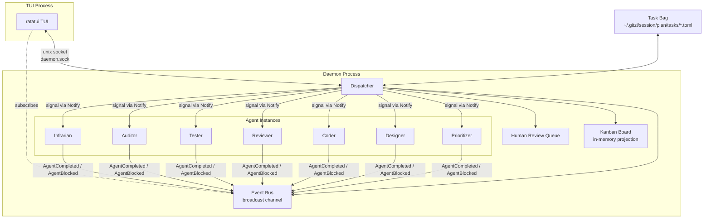
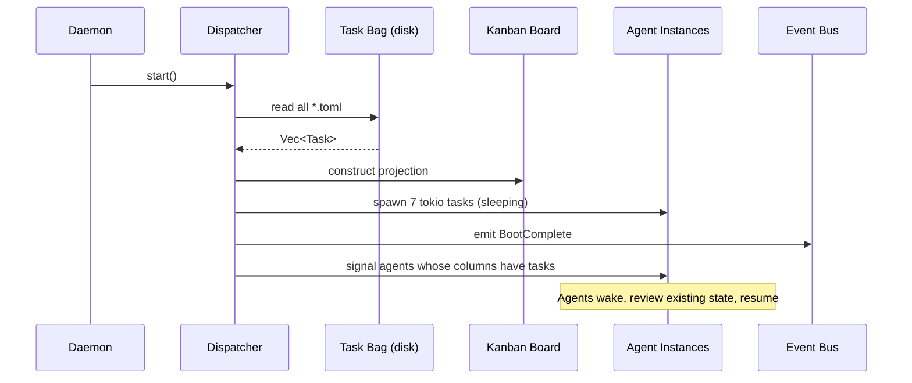
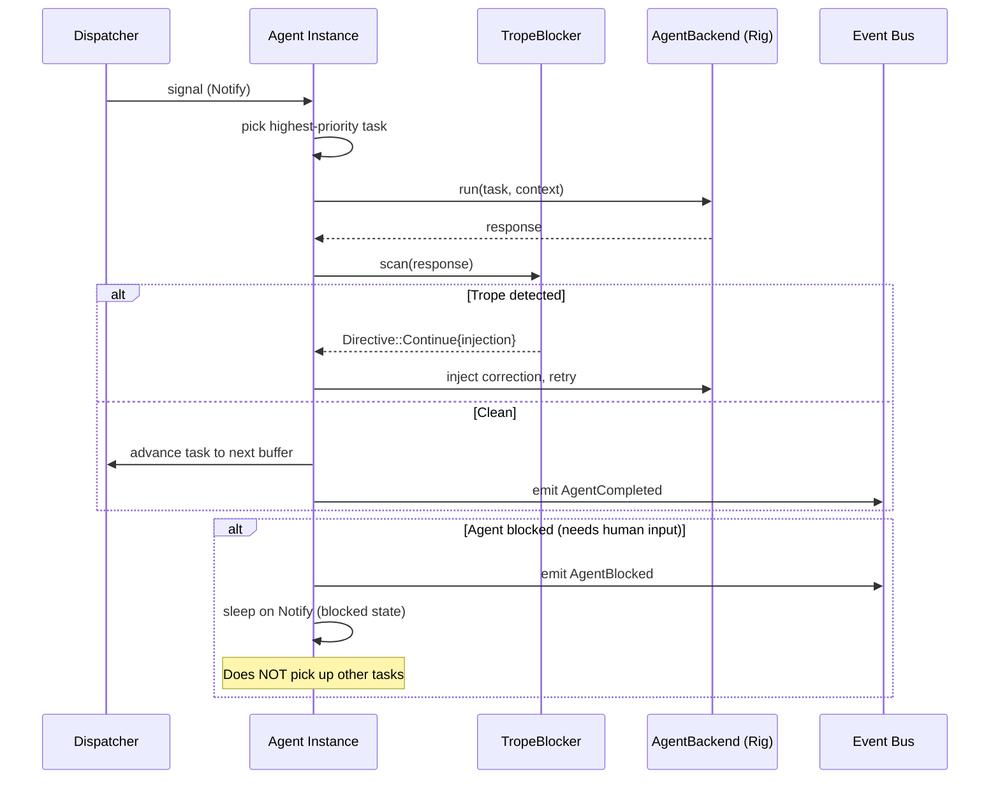
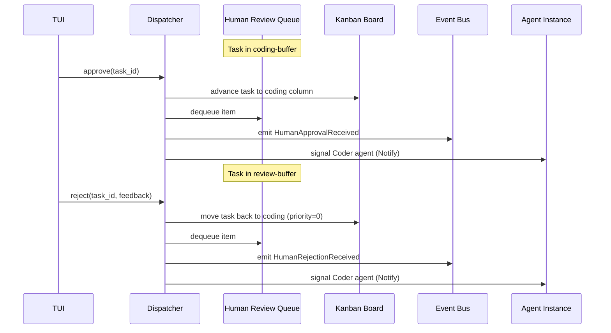

# Design Document: Event-Driven Dispatcher

## Overview

Replace the polling `Scheduler` (10-second `tokio::time::interval` loop in `src/pipeline/scheduler.rs`) with an event-driven `Dispatcher` that reacts to typed events on a `tokio::broadcast` channel. The new system models a 13-column Kanban board with buffer gates between every work stage, role-specific agent instances sleeping on `tokio::sync::Notify`, and a single human review queue that surfaces one item at a time.

The Dispatcher becomes the sole orchestration entry point in `cmd_daemon`. It owns:
- The Event Bus (broadcast channel)
- The Kanban Board (in-memory projection from task TOML files)
- Agent instance lifecycle (spawn, signal, block, resume)
- Human review queue management
- WIP limit enforcement

### Design Decisions

1. **Single broadcast channel vs per-agent channels**: One broadcast channel for all events. Agents subscribe and filter. This keeps the event topology flat and debuggable — adding a new event type requires no wiring changes.

2. **`tokio::sync::Notify` for agent wake**: Each agent holds its own `Notify`. The dispatcher signals it when work appears. Agents don't poll the channel — they receive a targeted wake signal. The broadcast channel is for system-wide observability (TUI, logging, future dashboard).

3. **Board is a projection, never persisted**: The board is rebuilt from task files on every boot. No drift between disk and memory because disk is always source of truth.

4. **Buffer columns are mandatory gates**: Every transition between work stages passes through a buffer requiring human approval. This enforces the "one thing at a time" principle — the human explicitly decides what moves forward.

## Architecture



### Boot Sequence



### Agent Work Cycle



### Approval / Rejection Flow



## Components and Interfaces

### Module Structure

| New Module | Replaces | Responsibility |
|---|---|---|
| `src/dispatcher/mod.rs` | `src/pipeline/scheduler.rs` | Event loop, dispatch logic, WIP enforcement |
| `src/dispatcher/event_bus.rs` | `src/state/watcher.rs` (partially) | Typed event channel, subscriber management |
| `src/dispatcher/board.rs` | (new) | Kanban board projection, column definitions, ordering |
| `src/dispatcher/review_queue.rs` | (new) | Human review queue, ordering logic, suppression |
| `src/dispatcher/agent_pool.rs` | (new) | Agent instance lifecycle, signal/block/resume |

| Retained Module | Changes |
|---|---|
| `src/pipeline/orchestrator.rs` | Trimmed — WIP logic moves to dispatcher, advance logic moves to dispatcher. May become thin wrapper or be absorbed. |
| `src/agent/backend.rs` | Unchanged — trait stays the same |
| `src/trope_blocker.rs` | Unchanged — called by agent instances after LLM response |
| `src/state/reader.rs`, `src/state/writer.rs` | Unchanged — dispatcher uses these for persistence |
| `src/daemon/mod.rs` | Updated — starts Dispatcher instead of Scheduler |

### Key Traits and Structs

```rust
// src/dispatcher/event_bus.rs

#[derive(Debug, Clone)]
pub enum DispatchEvent {
    TaskCreated { task_id: String },
    TaskStageChanged { task_id: String, from: Column, to: Column },
    HumanApprovalReceived { task_id: String, target_column: Column },
    HumanRejectionReceived { task_id: String, returned_to: Column, feedback: String },
    AgentCompleted { task_id: String, agent_role: AgentRole },
    AgentBlocked { task_id: String, agent_role: AgentRole, question: String },
    BootComplete,
}

pub struct EventBus {
    tx: broadcast::Sender<DispatchEvent>,
}

impl EventBus {
    pub fn new(capacity: usize) -> Self;
    pub fn emit(&self, event: DispatchEvent);
    pub fn subscribe(&self) -> broadcast::Receiver<DispatchEvent>;
}
```

```rust
// src/dispatcher/board.rs

#[derive(Debug, Clone, Copy, PartialEq, Eq, Hash, Serialize, Deserialize)]
pub enum Column {
    Prioritized,
    Designing,
    CodingBuffer,
    Coding,
    ReviewBuffer,
    Reviewing,
    TestBuffer,
    Testing,
    SecurityAuditBuffer,
    Auditing,
    DeploymentBuffer,
    Deploying,
    Done,
}

impl Column {
    /// All columns in pipeline order.
    pub fn all() -> &'static [Column];
    /// The next column after this one, or None if Done.
    pub fn next(&self) -> Option<Column>;
    /// The previous column before this one, or None if Prioritized.
    pub fn prev(&self) -> Option<Column>;
    /// True for buffer columns (require human approval).
    pub fn is_buffer(&self) -> bool;
    /// The agent role that works this column, if it's a work column.
    pub fn agent_role(&self) -> Option<AgentRole>;
}

pub struct KanbanBoard {
    columns: HashMap<Column, Vec<String>>,  // column -> task_ids sorted by priority
    tasks: HashMap<String, Task>,           // task_id -> full task data
}

impl KanbanBoard {
    pub fn from_tasks(tasks: Vec<Task>) -> Self;
    pub fn tasks_in(&self, column: Column) -> &[String];
    pub fn task(&self, id: &str) -> Option<&Task>;
    pub fn count(&self, column: Column) -> usize;
    pub fn advance(&mut self, task_id: &str, to: Column) -> Result<()>;
    pub fn set_priority(&mut self, task_id: &str, priority: u32);
}
```

```rust
// src/dispatcher/review_queue.rs

#[derive(Debug, Clone, PartialEq, Eq)]
pub enum ReviewItemKind {
    AgentQuestion { question: String },
    BufferApproval { buffer_column: Column },
}

#[derive(Debug, Clone)]
pub struct HumanReviewItem {
    pub id: String,
    pub task_id: String,
    pub kind: ReviewItemKind,
    pub created_at: DateTime<Utc>,
}

pub struct HumanReviewQueue {
    items: Vec<HumanReviewItem>,
}

impl HumanReviewQueue {
    pub fn new() -> Self;
    /// Insert maintaining sort invariant.
    pub fn enqueue(&mut self, item: HumanReviewItem);
    /// The topmost visible item (respects suppression rules).
    pub fn peek(&self) -> Option<&HumanReviewItem>;
    /// Remove and return the item with given id.
    pub fn dequeue(&mut self, item_id: &str) -> Option<HumanReviewItem>;
    /// True if any agent questions exist (suppresses buffer approvals).
    pub fn has_agent_questions(&self) -> bool;
    pub fn is_empty(&self) -> bool;
}
```

```rust
// src/dispatcher/agent_pool.rs

#[derive(Debug, Clone, Copy, PartialEq, Eq, Hash)]
pub enum AgentRole {
    Prioritizer,
    Designer,
    Coder,
    Reviewer,
    Tester,
    Auditor,
    Infrarian,
}

impl AgentRole {
    pub fn all() -> &'static [AgentRole];
    /// The work column this role processes.
    pub fn column(&self) -> Column;
}

pub struct AgentHandle {
    pub role: AgentRole,
    notify: Arc<Notify>,
    blocked: Arc<AtomicBool>,
}

impl AgentHandle {
    pub fn signal(&self);
    pub fn is_blocked(&self) -> bool;
}

pub struct AgentPool {
    agents: HashMap<AgentRole, AgentHandle>,
}

impl AgentPool {
    /// Spawn all agent tokio tasks, return handles.
    pub fn spawn(
        event_bus: EventBus,
        board: Arc<RwLock<KanbanBoard>>,
        config: Arc<Config>,
    ) -> Self;

    pub fn signal(&self, role: AgentRole);
    pub fn unblock(&self, role: AgentRole, answer: String);
}
```

```rust
// src/dispatcher/mod.rs

pub struct Dispatcher {
    event_bus: EventBus,
    board: Arc<RwLock<KanbanBoard>>,
    review_queue: Arc<Mutex<HumanReviewQueue>>,
    agent_pool: AgentPool,
    config: Arc<Config>,
    wip_limits: WipLimits,
}

impl Dispatcher {
    pub async fn start(config: Arc<Config>) -> Result<Self>;
    /// Main event loop — subscribes to the bus and reacts.
    pub async fn run(&self) -> Result<()>;
    pub fn approve(&self, task_id: &str) -> Result<()>;
    pub fn reject(&self, task_id: &str, feedback: &str) -> Result<()>;
    pub fn answer_question(&self, item_id: &str, answer: &str) -> Result<()>;
}
```

### TUI-Daemon Protocol Additions

The existing unix socket protocol (`ping` → `pong`, `status` → `running`) is extended with:

| Command (TUI → Daemon) | Response | Semantics |
|---|---|---|
| `subscribe` | Stream of JSON-encoded `DispatchEvent` lines (newline-delimited) | TUI subscribes to real-time events |
| `peek_review` | JSON-encoded `HumanReviewItem` or `null` | Get topmost review item |
| `approve <task_id>` | `ok` or `error: <msg>` | Approve a buffer gate item |
| `reject <task_id> <feedback>` | `ok` or `error: <msg>` | Reject with feedback |
| `answer <item_id> <answer>` | `ok` or `error: <msg>` | Answer an agent question |
| `board` | JSON-encoded board snapshot | Full board state for rendering |

The `subscribe` command holds the connection open and streams events as they occur. The TUI uses this to update its display reactively rather than polling.

### WIP Limit Enforcement

WIP limits are hardcoded per-column in source:

```rust
// src/dispatcher/mod.rs (or config.rs extended)

pub struct WipLimits {
    pub limits: HashMap<Column, u32>,
}

impl Default for WipLimits {
    fn default() -> Self {
        let mut limits = HashMap::new();
        // Work columns: 1 each
        limits.insert(Column::Prioritized, u32::MAX); // no limit on backlog staging
        limits.insert(Column::Designing, 1);
        limits.insert(Column::Coding, 1);
        limits.insert(Column::Reviewing, 1);
        limits.insert(Column::Testing, 1);
        limits.insert(Column::Auditing, 1);
        limits.insert(Column::Deploying, 1);
        // Buffer columns: 1 each
        limits.insert(Column::CodingBuffer, 1);
        limits.insert(Column::ReviewBuffer, 1);
        limits.insert(Column::TestBuffer, 1);
        limits.insert(Column::SecurityAuditBuffer, 1);
        limits.insert(Column::DeploymentBuffer, 1);
        // Done: unlimited
        limits.insert(Column::Done, u32::MAX);
        Self { limits }
    }
}
```

Enforcement happens in `Dispatcher::try_advance`:
1. Check target column's current count against its WIP limit.
2. If at limit → return `Err(WipLimitBlocked)`, task stays put.
3. If under limit → move task, emit `TaskStageChanged`, signal relevant agent if target is a work column.

### TropeBlocker Integration

TropeBlocker sits inside the agent instance's work loop, between the LLM response and the completion path:

```rust
// Inside agent_pool.rs agent loop:
let response = backend.run(&task, &ctx).await?;
match trope_blocker::scan(&response.output) {
    ScanResult::Clean => { /* proceed to advance */ }
    ScanResult::Blocked(trope_match) => {
        let directive = trope_blocker::execute(&trope_match, token_count, &summary);
        match directive {
            Directive::Continue { injection } => {
                // Inject correction, re-run agent with injection as user turn
            }
            Directive::RotateSession { summary } => {
                // Rotate agent session, seed with summary, re-run
            }
        }
    }
}
```

The TropeBlocker does not emit events — it's internal to the agent's work cycle. The dispatcher only sees the final clean result.

## Data Models

### Task TOML (extended)

```toml
id = "task-001"
epic = "epic-001"
title = "Add login endpoint"
stage = "coding-buffer"           # Now uses Column-aware stages
agent = "coder"
branch = "gitzi/task-001-add-login"
priority = 50
agent_feedback = ""               # Set on rejection
created_at = "2026-06-01T00:00:00Z"
updated_at = "2026-06-01T00:00:00Z"

[[history]]
kind = "stage_change"
from = "coding"
to = "coding-buffer"
at = "2026-06-01T01:00:00Z"
note = "agent completed"

[[history]]
kind = "approval"
at = "2026-06-01T02:00:00Z"
target_stage = "coding"

[[history]]
kind = "rejection"
at = "2026-06-01T03:00:00Z"
feedback = "Missing error handling for network timeout"
returned_to = "coding"
```

### Column ↔ AgentRole Mapping

| Column | AgentRole | Buffer After |
|---|---|---|
| Prioritized | Prioritizer | — (tasks start here) |
| Designing | Designer | CodingBuffer |
| Coding | Coder | ReviewBuffer |
| Reviewing | Reviewer | TestBuffer |
| Testing | Tester | SecurityAuditBuffer |
| Auditing | Auditor | DeploymentBuffer |
| Deploying | Infrarian | Done |

### Human Review Queue Ordering

Sort key (ascending):
1. `kind == AgentQuestion` first (all questions before all approvals)
2. Within questions: `created_at` ascending (FIFO)
3. Within approvals: column position descending (rightmost buffer first — `DeploymentBuffer` before `CodingBuffer`)
4. Within same column: task priority ascending (lowest number = highest priority)

## Correctness Properties

*A property is a characteristic or behavior that should hold true across all valid executions of a system — essentially, a formal statement about what the system should do. Properties serve as the bridge between human-readable specifications and machine-verifiable correctness guarantees.*

### Property 1: Board construction preserves task-to-column mapping

*For any* set of valid task TOML files with various stages, constructing a `KanbanBoard` from those tasks SHALL place each task in the column corresponding to its persisted stage, with no tasks lost or duplicated.

**Validates: Requirements 2.1, 2.2**

### Property 2: Column priority ordering invariant

*For any* `KanbanBoard` state and any sequence of task insertions with random priorities, the tasks within each column SHALL always be sorted by priority ascending (lowest number first).

**Validates: Requirements 3.2**

### Property 3: State mutation emits corresponding event

*For any* state-mutating operation (task advance, approval, rejection) executed through the Dispatcher, the Event Bus SHALL receive exactly one event of the corresponding type containing the correct task_id and metadata.

**Validates: Requirements 1.2**

### Property 4: WIP limit enforcement

*For any* column at its WIP limit and any task attempting to advance into that column, the advancement SHALL be rejected and the task SHALL remain in its current column with no state change.

**Validates: Requirements 4.1, 4.2**

### Property 5: WIP release emits signal

*For any* column that was at its WIP limit, when a task leaves that column, the Dispatcher SHALL emit a `TaskStageChanged` event.

**Validates: Requirements 4.3**

### Property 6: Agent picks highest-priority task

*For any* work column containing multiple tasks with distinct priorities, when the corresponding agent wakes, it SHALL select the task with the lowest priority number.

**Validates: Requirements 5.4**

### Property 7: Agent completion advances to correct buffer

*For any* task in a work column, when the agent completes processing, the task SHALL advance to the immediately following buffer column (or Done for Deploying).

**Validates: Requirements 5.5**

### Property 8: Buffer columns block without approval

*For any* task in any buffer column, the task SHALL NOT advance to the next work column without an explicit human approval action. Automatic advancement SHALL be impossible.

**Validates: Requirements 6.1**

### Property 9: Buffer entry creates review item

*For any* task entering any buffer column, a `HumanReviewItem` of kind `BufferApproval` SHALL be created linking to that task and enqueued in the `HumanReviewQueue`.

**Validates: Requirements 6.2**

### Property 10: Approval advances correctly and records history

*For any* task in any buffer column, upon approval, the task SHALL advance to the next work column, a history entry with timestamp and target stage SHALL be appended, and a `HumanApprovalReceived` event SHALL be emitted.

**Validates: Requirements 6.3, 8.1**

### Property 11: Rejection semantics

*For any* task in any buffer column, upon rejection with feedback text, the task SHALL move to the immediately preceding work column with priority set to 0, the feedback SHALL be stored in `agent_feedback`, a history entry with timestamp, feedback, and return stage SHALL be appended, and a `HumanRejectionReceived` event SHALL be emitted.

**Validates: Requirements 6.4, 8.2, 9.1, 9.2, 9.3**

### Property 12: Queue ordering invariant

*For any* set of `HumanReviewItem`s with mixed kinds (agent questions and buffer approvals), various timestamps, buffer columns, and task priorities, the queue SHALL maintain ordering: all agent questions first (sorted by arrival time), then buffer approvals sorted by rightmost column first, then by task priority ascending within the same column.

**Validates: Requirements 7.2**

### Property 13: Queue visibility — questions suppress approvals

*For any* `HumanReviewQueue` containing at least one agent question item, `peek()` SHALL return an agent question item and SHALL NOT return a buffer approval item. When all agent questions are removed, `peek()` SHALL return the topmost buffer approval.

**Validates: Requirements 6.5, 7.3, 7.4**

### Property 14: History serialization round-trip

*For any* task history entry (stage change, approval, or rejection with arbitrary feedback text), serializing to TOML and deserializing back SHALL produce an equivalent entry.

**Validates: Requirements 8.3**

### Property 15: Rejection feedback propagates to agent context

*For any* task with a non-empty `agent_feedback` field, when an agent picks up that task, the prompt context SHALL contain the feedback string.

**Validates: Requirements 9.3, 9.4**

### Property 16: Blocked agent rejects new work

*For any* agent instance in a blocked state (waiting on a human answer), if new tasks enter its column, the agent SHALL NOT process them until unblocked.

**Validates: Requirements 10.2**

### Property 17: Boot signals correct agents

*For any* board state constructed on boot with tasks distributed across various work columns, the Dispatcher SHALL signal exactly the set of agents whose corresponding columns contain at least one task, and SHALL NOT signal agents with empty columns.

**Validates: Requirements 13.1**

### Property 18: Boot resume includes work state in context

*For any* task in a work column on boot that has an existing branch and prior commits, the agent SHALL include a work state summary in its prompt context before resuming execution.

**Validates: Requirements 13.2, 13.3**

### Property 19: Agent wake signal on column entry

*For any* task entering a work column at runtime, the Dispatcher SHALL signal the agent whose role matches that column.

**Validates: Requirements 5.3**

## Error Handling

| Error Condition | Handling |
|---|---|
| Invalid stage in task TOML | Log warning, default to `Prioritized` column |
| WIP limit exceeded on advance | Return `WipLimitBlocked` error, task stays in current column |
| Agent backend failure (`AgentResult.success == false`) | Log output, leave task in current column, do not advance |
| Agent backend error (network, timeout) | Log error, leave task in current column, agent sleeps until re-signaled |
| Task file write failure | Return IO error, do not emit event (operation failed) |
| TUI socket disconnection | Agent continues working; TUI reconnects and re-subscribes |
| Broadcast channel full (lagged receiver) | Receiver gets `RecvError::Lagged` — TUI requests full board snapshot to resync |
| Boot finds no task files | Empty board, all agents sleep, BootComplete still emits |
| Unrecognized protocol command from TUI | Respond with `error: unknown command` |

## Testing Strategy

### Property-Based Testing

**Library**: `proptest` (Rust PBT crate, already compatible with the ecosystem)

Each correctness property above maps to a single property-based test. Configuration:
- Minimum 100 iterations per property test (proptest default is 256, which exceeds this)
- Tag format in test comments: `// Feature: event-driven-dispatcher, Property N: <text>`

Property tests will exercise:
- `KanbanBoard::from_tasks` with generated task vectors
- `HumanReviewQueue` ordering with generated item sets
- `WipLimits` enforcement with generated board states
- History TOML serialization round-trips with generated history entries
- Dispatcher advance/approve/reject logic with mocked persistence

### Unit Tests

Example-based tests for:
- Column ordering (`Column::all()` returns exact expected sequence)
- Default WIP limits match spec values
- Boot with empty task directory
- Boot with invalid task file (malformed TOML)
- Agent role ↔ column mapping correctness
- Protocol command parsing for new socket commands

### Integration Tests

- Full boot → advance → approve cycle through the daemon socket
- Agent blocks → TUI answers → agent resumes
- WIP limit blocks advancement → task leaves → blocked agent wakes
- TUI disconnect and reconnect with state resync
